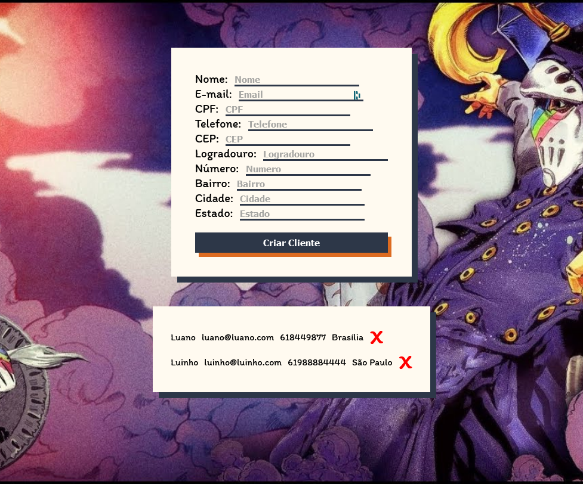

</img>

# Cadastro e remoção de clientes com AlpineJS

Simples """"sistema"""" de cadastro e remoção de clientes feito com <a href="https://github.com/alpinejs/alpine">AlpineJS</a>. A aplicação mantém estado pois os clientes são guardados em local storage.

Como estou usando Alpine, não há necessidade de instalar nada. Apenas baixe ou clone o repositório, abre o arquivo html e é isso.

No formulário com o desafio, não foi citado explicitamente como ou com qual tecnologia poderíamos ou não desenvolver o sistema. Escolhi Alpine pois gosto de coisas simples. Tenho mais outro projeto usando Alpine, caso queira dar uma olhada:
https://github.com/tilucast/Studio-Ghibli-Films-with-Alpinejs

É isso. Para mais informações, leia a documentação do framework.